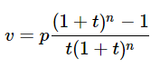

# Lista de Exercicios Introdução ao Python
**Semana 1,2 e 3**

1. Crie um programa que receba a data de nascimento de uma pessoa em: dia, mês e ano. Calcule a idade da pessoa em anos. [Resposta](resolucaoExercicios/Lista%201/ex1.py)

2. Elabore um conversor de graus Celsius para graus Fahrenheit.  [Resposta](resolucaoExercicios/Lista%201/ex2.py)

3. Leia o tamanho de um lado do triangulo, e imprima a sua area dada por A = L^2, em que L é o lado do quadrado. [Resposta](resolucaoExercicios/Lista%201/ex3.py) 

4. Escreva um programa que lê três notas de um aluno (no intervalo de 0 à 10) e faça a media aritmetica.  [Resposta](resolucaoExercicios/Lista%201/ex4.py)

5. Calcular a área de um círculo dado o seu raio. O programa lê o valor do raio (um número real) e imprime o valor da área do círculo. (ver Constante PI da Classe Math; para utilizá-lo escreva math.pi)   [Resposta](resolucaoExercicios/Lista%201/ex5.py)

6. Suponha que uma pessoa precise financiar uma compra em um dado número de parcelas, de mesmo valor, a uma determinada taxa bancária mensal. Calcule, então, o valor presente para esse caso, que é dado pela seguinte fórmula:  
  
    **em que:** *v* é o valor presente em reais, *p* é o valor da prestação em reais, *t* é a taxa mensal e *n* é o número de parcelas. A taxa t deve ser inserida como uma porcentagem, mas deve ser convertida para um valor entre 0 e 1 para ser aplicada na fórmula. A ordem das entradas deve ser primeiro o valor da prestação, depois o número de parcelas e, por último, a taxa mensal.  

    [Resposta](resolucaoExercicios/Lista%201/ex6.py)

7. Calcular o montante que resulta da aplicação de um capital (R$) durante n meses à taxa de t % ao mês, considerando juros compostos.
    O programa lê os valores do capital (valor real), do número de meses (valor natural) e a taxa (valor real correspondente ao percentual no intervalo 0 a 100) e imprima o valor do montante, arredondado na segunda casa decimal. [Resposta](resolucaoExercicios/Lista%201/ex7.py)

    💡 Exercicio a seguir dificil! Talvez você não consiga resolver.

8. O salário base dos funcionários de uma empresa é de R$ 2.500,00 por mês para um regime de trabalho de 200 horas mensais. No caso do funcionário trabalhar em horário normal menos que as 200 horas, ele recebe valor proporcional às horas trabalhadas. Para o caso de trabalho em horas extras, o valor da hora extra trabalhada corresponde ao valor da hora regular de trabalho acrescido de 20%. 
   - Sobre o salário bruto (salário sobre as horas normais + salário sobre as horas extras) são feitas duas deduções:
     - 9% de seguridade social;
     - 13% de imposto de renda.

    Dados, então, o número de horas normais (um número inteiro no intervalo de 0 a 200) e o número de horas extras (um número inteiro maior ou igua a zero) trab'alhadas no mês por um funcionário, calcule o salário líquido ao qual ele tem direito, imprimindo como resultado informação como a exemplificada abaixo, sendo que todos os valores devem ser arredondados na segunda casa decimal:

    > Salário Bruto : R$ 2500.0  
    > IR (13%) : R$  325.0  
    > INSS (9%) : R$  225.0  
    > Salário Liquido : R$  1950.0  

    [Resposta](resolucaoExercicios/Lista%201/ex8.py)

9. Dados os valores a, b e c de uma equação quadrática no formato (a.x2 + b.x + c), implementar um programa que leia os três valores (nesta ordem) e imprima os valores das raízes reais da equação.  

    [Resposta](resolucaoExercicios/Lista%201/ex9.py)